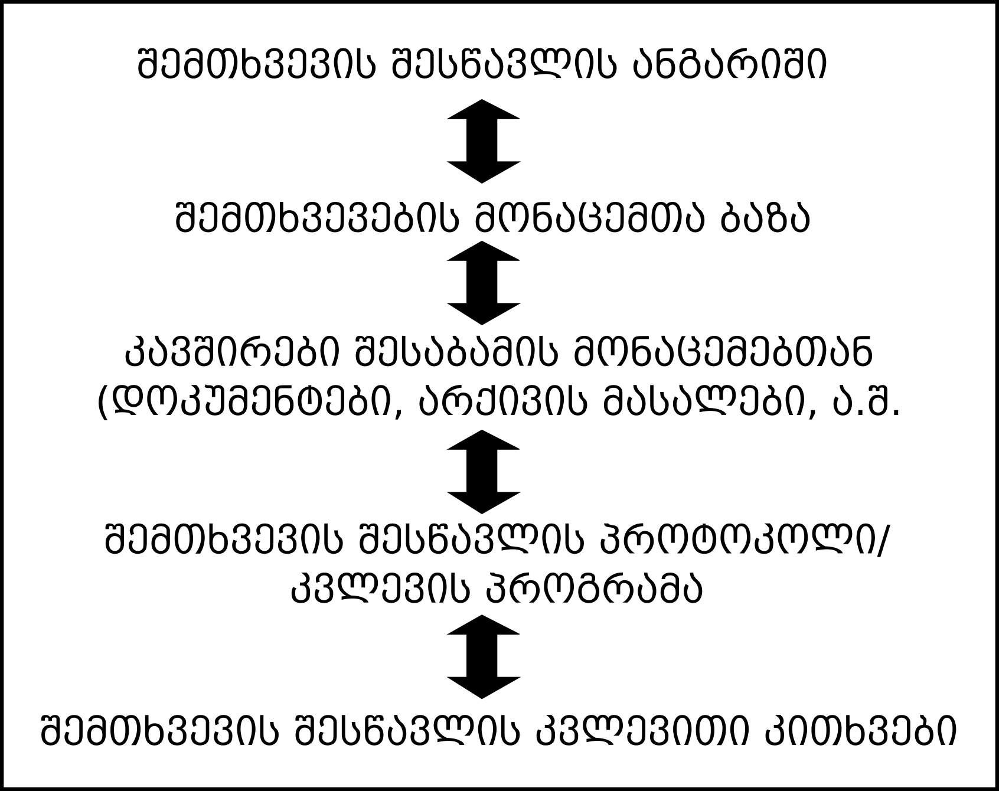

## დასკვნითი დავალების აღწერა

თქვენი დასკვნითი, ფინალური დავალება წარმოადგენს საპროექტო განაცხადის შედგენას იმ ფორმატით, რომელიც [დამტკიცებულია საქართველოს ეროვნული სამეცნიერო ფონდის მიერ](http://www.rustaveli.org.ge/2018-%E1%83%AC%E1%83%9A%E1%83%98%E1%83%A1-%E1%83%99%E1%83%9D%E1%83%9C%E1%83%99%E1%83%A3%E1%83%A0%E1%83%A1%E1%83%94%E1%83%91%E1%83%98/page/2274). რა თქმა უნდა, ეს არ არის საპროექტო განაცხადის ერთადერთი ფორმატი, თუმცა საქართველოს კონტექსტში იგი ხშირად გამოიყენება.

საპროექტო განაცხადის ასაკრებად გამოიყენეთ ვორდის დოკუმენტი, ტექსტი ტრადიციულად უნდა იყოს ქართულად, 12 ზომის ფონტით და სტრიქონებს შორის 1.5 ერთეული დაშორებით. დასრულებული საპროექტო განაცხადს უნდა დაარქვათ თქვენი სახელი და გვარი და ატვირთოთ 27 ივნისის საღამომდე [ამ ბმულზე](https://www.dropbox.com/request/TaWKnr1sFV7XRaJF7CD2). გაითვალისწინეთ, რომ დავალება მაღალი ქულით ფასდება. თუ ტექსტში რაიმე ციტირებას მოიტანთ, აუცილებლად მიუთითეთ წყარო APA ფორმატით და დაურთოთ ბიბლიოგრაფიის სახით (დეტალურად APA სტილით გაფორმების შესახებ [იხილეთ ამ ბმულზე](https://www.scribd.com/doc/47867090/APA-axali-3))

კვლევითი პროექტი შედგება შემდეგი ნაწილებისგან: 

+ კვლევითი თემის/საკითხის აქტუალობა, კვლევის სიახლე და ინოვაციურობა, პრობლემის ფორმულირება
+ კვლევის მიზნები და ამოცანები
+ კვლევის მეთოდოლოგია

### კვლევითი თემის/საკითხის აქტუალობა, კვლევის სიახლე და ინოვაციურობა, პრობლემის ფორმულირება

ამ სექციაში მოკლედ უნდა აღწეროთ (ა) თქვენი საკვლევი საკითხი, (ბ) უნდა დაასაბუთოთ, თუ რატომაა პროექტი მნიშვნელოვანი და აქტუალური, (გ) ჩამოაყალიბოთ კვლევითი პრობლემა - ანუ აღწეროთ კვლევითი კითხვა. ასევე, აქვე შეიძლება ახსენოთ, თუ რა მეთოდით ან მიდგომით შეისწავლით ამ საკითხს. ტექსტის მაქსიმალური რაოდენობა უნდა შეადგენდეს 500-მდე სიტყვას. ქვემოთ მოცემულია თითოეული ქვეკომპონენტის მოკლე აღწერა

#### საკითხის აღწერა და აქტუალობა

ამ ქვესექციის საწყის აბზაცში მოკლედ დაახასიათეთ, თუ რა საკითხის გამოკვლევა გსურთ; რატომ თვლით, რომ იგი საინტერესოა. აღწერეთ, რა არგუმენტები ამყარებს თქვენს არჩევანს.

ტექსტის მომდევნო ორი ან სამი აბზაცი უნდა დაუთმოთ _ზოგად თეორიულ მიმოხილვას_. თეორიულ მიმოხილვაში ვგულისხმობთ ნებისმიერ კონცეპტუალურ საფუძველს, რომელიც თქვენი კვლევის შესაბამისად მიგაჩნიათ. მაგალითად:

+ დერეკ ელდერმანი და ჯოშ ინვუდი (2013) ამერიკის შეერთებული შტატების სამხრეთში ტოპონიმიკის შესწავლისას ეყრდნობოდნენ ადგილმდებარეობის სახელწოდებათა შესწავლისადმი კრიტიკულ მიდგომას. ამ მიდგომის მიხედვით, რაიმე ადგილისთვის სახელის დარქმევის პრაქტიკა წარმოადგენს ადამიანთა მეხსიერების სოციალურ კონსტრუირებას და გვკარნახობს, თუ რა მნიშვნელობას ვანიჭებთ ტოპონიმებს.
+ სარა ბირჩი (1997) აანალიზებს უკრაინაში საარჩევნო კლიენტალიზმს. იგი ეყრდნობა კლიენტალიზმის მაქს ვებერისეულ განმარტებას, რომლის მიხედვითაც ნებისმიერი პარტიული ბრძოლა წარმოადგენს როგორც ობიექტური მიზნების, ასევე - პოლიტიკური თანამდებობების დასაკავებლად მიმართულ საქმიანობას.
+ პიერ ბურდიე (1977) ლინგვისტური მიმოცვლის ეკონომიკის შესახებ [საუბრისას](http://logic.amu.edu.pl/images/f/f4/Bourdieu.pdf), ეყრდნობა ფერდინანდ დე სოსიურის მიერ შემოთავაზებულ ენის განმარტებას. ამ კონცეფციის თანახმად, კანონმდებლობის და კომუნიკატიური კოდიფიცირებული ენა (ე.წ. _parole_) დამოუკიდებლად არსებობს იმ ადამიანებისგან (ე.წ. მოლაპარაკე სუბიექტებისგან), რომლებიც ამ ენას სასაუბროდ გამოიყენებენ.
	
#### სიახლე და ინოვაციურობა:

ამ ქვესექციაში ახსენებთ, თუ რა სიახლეს გვთავაზობს თქვენი კვლევა. ეს შეიძლება იყოს, მაგალითად ის, რომ ამ საკითხზე კვლევა არ არის ჩატარებული საქართველოში, ან - აპირებთ, რომ ახალი თეორიული მიმართულებით შეისწავლოთ ეს საკითხი და ა.შ. გაითვალისწინეთ, რომ აქაც უნდა დაასაბუთოთ თქვენი არჩევანი. ვთქვათ, თუ მსგავსი პროფილის კვლევები არ არსებობს, მაინც უნდა იპოვოთ მეტნაკლებად მონათესავე კვლევა და თქვათ, რომ მიუხედავდა იმისა, რომ რაღაც კვლევები არსებობს, ისინი თქვენთვის საინტერესო საკითხებს არ შეისწავლიან. მაგალითად:

+ მართალია, ურბანული ტრანსპორტის შესახებ ჩატარებული კვლევები (მაგალითად, თბილისის მერიისთვის კომპანია ACT-ის მიერ გაკეთებული ანალიზი, ასევე - ფრანგული კომპანია SYSTRA-ს მიერ მომზადებული სატრანსპორტო გეგმის წინასაპროექტო გეგმა) გარკვეულ წარმოდგენას გვაძლევს ტრანსპორტის მოხმარებაზე, მაგრამ ისინი ხშირად უგულებელყოფენ პრობლემის _სოციალურ_ განზომილებას, კერძოდ - უთანასწორობას მობილობისა და ტრანსპორტზე ხელმისაწვდომობის თვალსაზრისით. მეთოდოლოგიურით თვალსაზრისით, კვლევის ინოვაციას წარმოადგენს თვისებრივი მიდგომა, რაც საშუალებას იძლევა, უკეთ შევაფასოთ ტრანსპორტით გადაადგილების აღქმა თბილისის მოსახლეობაში.

#### პრობლების ფორმულირება

აქ უნდა დაახასიათოთ თქვენი კვლევითი კითხვები, რომლებიც სიმარტივისთვის შეგიძლიათ, პუნქტებად ჩამოთვალოთ. თუმცა ასევე უნდა მიაყოლოთ ახსნა, თუ რატომ გახდა საჭირო მაინცდამაინც ამ კითხვების შესწავლა. გაითვალისწინეთ, რომ აქ _რესპონდენტისთვის დასასმელი კითხვები არ გვჭირდება_. უნდა მიუთითოთ _ფართო_ შეკითხვა, რომელზე პასუხის გაცემაც თქვენი კვლევის ამოცანას წარმოადგენს.
 
თუ თქვენი კვლევისთვის უკვე მოფიქრებული გაქვთ რაიმე ტიპის ჰიპოთეზა, შეგიძლიათ, ისიც აქვე მოიტანოთ.

### კვლევის მიზნები და ამოცანები
აქ უნდა აღწეროთ კვლევის მიზნები და ამოცანები; ჩამოთვალოთ და მოკლედ დაახასიათოთ პროექტის საბოლოო მიზნის მისაღწევად შესასრულებელი ამოცანები და ეტაპები. სიტყვების მაქსიმალური რაოდენობა 150-200-ს უნდა შეადგენდეს.

ამ სექციის მოსამზადებლად, დაფიქრდით, თუ რა უნდა მოიმოქმედოთ, რათა კვლევა ჩაატაროთ. კვლევის ამოცანები შეგიძლიათ, გადანომროთ და ქრონოლოგიური მიმდევრობით დაალაგოთ. მაგალითად:

* ამოცანა 1: შევიმუშავებთ პრეტესტული მღელვარების შესასწავლ სკალას. ამ მიზნით გავეცნობით შესაბამის ლიტერატურას და ვთარგმნით კვლევის ინსტრუმენტს ქართულ ენაზე
* ამოცანა 2: ჩავატარებთ რაოდენობრივ კვლევას სოციალურ და პოლიტიკურ მეცნიერებათა ფაკულტეტის სტუდენტებს შორის. ამ მიზნით, გამოვკითხავთ 250 სტუდენტს სტატისტიკის და კვლევის მეთოდების გამოცდებამდე და გამოცდების შემდეგ

### კვლევის მეთოდოლოგია და კვლევითი ინსტრუმენტის დახასიათება

საპროექტო განაცხადის დასკვნითი კომპონენტი შედგება როგორც კვლევის ინსტრუმენტისგან (კითხვარი, სადისკუსიო გეგმა, კოდირების სახელმძღვანელო...), ასევე - ორ- ან სამაბზაციანი ტექსტისგან, სადაც მოკლედ შეაჯამებთ, თუ რატომ იყენებთ ამ კონკრეტულ მეთოდს და რას როგორ ზომავთ - ანუ იყენებთ ამ კონკრეტულ კითხვებს და ა.შ. თუ სიღრმისეულ ინტერვიუებს ან ფოკუს-ჯგუფებს ატარებთ, დაგჭირდებათ სადისკუსიო გეგმის შედგენა, მასობრივი გამოკითხვისთვის და ექსპერიმენტისთვის - კითხვარი (შესაბამისი ექსპერიმენტული პირობით). ასევე დაახასიათეთ ის გენერალური თუ შერჩევითი ერთობლიობა, რომლის წარმომადგენლებსაც შეისწავლით. თუკი მეთოდად შემთხვევის შესწავლას (case study) იყენებთ, მაშინ დეტალურად უნდა აღწეროთ ის დოკუმენტები, მონაცემები, საარქივო ჩანაწერები, ან სხვა ნებისმიერი მასალა, რასაც გააანალიზებთ, ასევე უნდა დაასაბუთოთ თქვენი არჩევანი. ქვემოთ მოცემულია კვლევის ინსტრუმენტის რამდენიმე მაგალითი.

#### სიღრმისეული ინტერვიუ
მაგალითები:

* [ინტერვიუები არჩევნების შესახებ](https://www.dropbox.com/s/16r92x25608gvkj/DiscussionGuide_Draft_KA.pdf?dl=0);
* [სოციალური გარიყვის სადისკუსიო გეგმა საკვანძო ინფორმანტებისთვის](https://www.dropbox.com/s/zqnguccgwmm9n06/KII_guide_task1_crrc_03152016_Georgian.pdf?dl=0)
* ზურაბიშვილი, გვ. 24-25;

#### ფოკუსჯგუფი

* [სოციალური გარიყვის სადისკუსიო გეგმა ფოკუს-ჯგუფებისთვის](https://www.dropbox.com/s/gc9zaqkfn9wy419/FG_guide_task1_crrc_03242016_after_test_Georgian.pdf?dl=0)
* ზურაბიშვილი, გვ. 37-38;

#### მასობრივი გამოკითხვის კითხვარი
* [17 მაისი](https://www.dropbox.com/s/ur0e3k6bdjjculb/17_%E1%83%9B%E1%83%90%E1%83%98%E1%83%A1%E1%83%98_2013.pdf?dl=0)
* [ევროკავშირი](https://www.dropbox.com/s/bu1pl1ja9kq3l14/%E1%83%94%E1%83%95%E1%83%A0%E1%83%9D%E1%83%99%E1%83%90%E1%83%95%E1%83%A8%E1%83%98%E1%83%A0%E1%83%98_2015.pdf?dl=0)
* [მოხალისეობა](https://www.dropbox.com/s/wwj7l1jt6jrbl3b/%E1%83%9B%E1%83%9D%E1%83%AE%E1%83%90%E1%83%9A%E1%83%98%E1%83%A1%E1%83%94%E1%83%9D%E1%83%91%E1%83%90_2014.pdf?dl=0)
* [პროტესტი და პოლიტიკა](https://www.dropbox.com/s/fe04fgid701da1n/%E1%83%9E%E1%83%A0%E1%83%9D%E1%83%A2%E1%83%94%E1%83%A1%E1%83%A2%E1%83%98_%E1%83%93%E1%83%90_%E1%83%9E%E1%83%9D%E1%83%9A%E1%83%98%E1%83%A2%E1%83%98%E1%83%99%E1%83%90.pdf?dl=0)
* [საერთაშორისო გამჭვირვალობა](https://www.dropbox.com/s/6agizintavoyu2q/%E1%83%A1%E1%83%90%E1%83%94%E1%83%A0%E1%83%97%E1%83%90%E1%83%A8%E1%83%9D%E1%83%A0%E1%83%98%E1%83%A1%E1%83%9D_%E1%83%92%E1%83%90%E1%83%9B%E1%83%AD%E1%83%95%E1%83%98%E1%83%A0%E1%83%95%E1%83%90%E1%83%9A%E1%83%9D%E1%83%91%E1%83%90_2016.pdf?dl=0)

#### ექსპერიმენტის ინსტრუმენტი
ექსპერიმენტისთვის შეგიძლიათ, გამოიყენოთ მასობრივი გამოკითხვის კითხვარები, ოღონდ ამ შემთხვევაში, ცალკე უნდა იყოს განხილული, თუ როგორ ჩამოყალიბდება ექსპერიმენტული და საკონტროლო პირობები. ასევე - რა იქნება დამოუკიდებელი ცვლადი.

* [ექსპერიმენტი პოლიტიკური ცოდნის და არჩევნებში მონაწილეობის შესახებ. დეტალურად - მე-17 გვერდიდან](https://www.dropbox.com/s/rsobzkxe4nw149q/ASCN%20experiment%20questionnaire_GE_2015.09.18.pdf?dl=0)
* [ექსპერიმენტი პრეზიდენტის ინსტიტუტისადმი ნდობის შესახებ](https://drive.google.com/open?id=1lH15h1pGd8dTW5zlvbfhM5mnLKELn-cCK9vpTnfVJ1w)

#### შემთხვევის შესწავლა / მონოგრაფიული გამოკვლევა (case study)

_წინამდებარე ტექსტი ეფუძნება რობერტ ინის (Robert Yin) წიგნს ,,შემთხვევის შესწავლის მეთოდი და დიზაინი''. წიგნის ჩამოტვირთვა [ამ ბმულიდან](https://www.dropbox.com/s/4uqxvd1un9owv8v/Yin_Case_Study_Design.pdf?dl=0) შეგიძლიათ._

მარტივად რომ ვთქვათ, შემთხვევის შესწავლა ფენომენის მრავალმხრივ და ამომწურავ გამოკვლევას გულისხმობს. რობერტ ინი შემთხვევის შესწავლისთვის საჭირო მონაცემების ექვს მთავარ წყაროს გამოყოფს: დოკუმენტებს, საარქივო ჩანაწერებს, ინტერვიუებს, პირდაპირ დაკვირვებას, ჩართულ დაკვირვებას და ფიზიკურ არტეფაქტებს. თუმცა, მონაცემთა წყაროები ამით არაა შეზღუდული. დასაბუთების პირობებში, შეგიძლიათ, სხვა მეთოდებიც გამოიყენოთ. ქვემოთ მოყვანილ ცხრილში შეჯამებულია თითოეული ტიპის მონაცემების დადებითი და უარყოფითი მხარეები:

| წყარო                | დადებითი მხარე                                                     | სისუსტე                                                                             |
|----------------------|--------------------------------------------------------------------|-------------------------------------------------------------------------------------|
| __დოკუმენტები__      |  სტაბილურია - შესაძლებელია მრავალჯერ შესწავლა                     |  მოპოვება რთულია                                                                   |
|                      |  არ არის საეჭვო - არ იქმნება კვლევის პირობებში                    |  შეიძლება, იყოს მიკერძოებული, თუ შეგროვებისას რომელიმე მათგანი გამოგვრჩა           |
|                      |  მოაქვს ზუსტი სახელები, წყაროები და მოვლენათა დეტალები            |  შეიძლება, შედგენისთანავე იყოს მიკერძოებული                                        |
|                      |  ფართო დაფარვა                                                    |  ხელმისაწვდომობა შეიძლება, შეზღუდული იყოს                                          |
|__საარქივო ჩანაწერები__| [იგივე, რაც დოკუმენტები]                                          | [იგივე, რაც დოკუმენტები]                                                           |
|                      |  ამომწურავი და როგორც წესი, რაოდენობრივი                          |  ხელმისაწვდომობა შეიძლება, შეზღუდული იყოს, პირადი საიდუმლოს ხელშეუხებლობის მოტივით |
|__ინტერვიუები__       |  ფოკუსირებულია საკვლევ თემაზე                                     |  ცუდად ჩამოყალიბებული კითხვების გამო არსებული მიკერძოება                           |
|                      |  გვაძლევს რესპონდენტის მიერ აღქმულ მიზეზშედეგობრივ კავშირებს      |  არგამოპასუხება                                                                    |
|                      |                                                                    |  რესპონდენტი გვეუბნება იმას, რისი გაგებაც ჩვენ გვინდა                              |
|__პირდაპირი დაკვირვება__|  რეალობა - მოვლენებს მიმდინარეობისთანავე აღწერს                   |  ხანგრძლივვადიანია                                                                 |
|                      |  აღწერს შემთხვევის კონტექსტს                                      |  შერჩევითობა - ფართო დაფარვა დამკვირვებელთა დიდი ქსელის გარეშე შეუძლებელია         |
|                      |                                                                    |  მოვლენა დაკვირვების გამო, შეიძლება, სხვანაირად წარიმართოს                         |
|                      |                                                                    |  ღირებულება                                                                        |
|__ჩართული დაკვირვება__|  [იგივე, რაც პირდაპირი დაკვირვება]                                |  [იგივე, რაც პირდაპირი დაკვირვება]                                                 |
|                      |  ადამიანებთან ურთიერთობის გამო, მოვლენების უფრო სიღრმისეული აღქმა |  დამკვირვებლის მხრიდან მანიპულირების გამო არსებული მიკერძოება                      |
|__ფიზიკური არტეფაქტები__|  კულტურული თავისებურებების უკეთ გაგება                            |  შერჩევითობა                                                                       |
|                      |  მოვლენის ტექნიკური / ტექნოლოგიური მხარის უკეთ გაგება             |  ხელმისაწვდომობა                                                                   |

თუკი მონაცემებად დოკუმენტებს გამოიყენეთ, გაითვალისწინეთ შემდეგი ტიპის წყაროები:
* წერილები, მემორანდუმები, ელ.ფოსტის კორესპონდენცია, დღიურები, პირადი კალენდრები და ჩანაწერები;
* შეხვედრათა გრაფიკები (ე.წ. აჯენდა), ღონისძიებათა შესახებ არსებული ანგარიშები;
* ადმინისტრაციული დოკუმენტები;
* თქვენს მიერ შესასწავლი შემთხვევების შესახებ არსებული ანგარიშები;
* ახალი ამბები მასობრივ მედიაში;

რობერტ ინი საარქივო ჩანაწერებში შემდეგი ტიპის ინფორმაციას გამოყოფს:
* საჯარო ინფორმაცია, მაგალითად - სტატისტიკური მონაცემები, რომლებსაც შესაბამისი სამთავრობო სტრუქტურები აქვეყნებენ;
* სამომხმარებლო ორგანიზაციული დოკუმენტები (მაგალითად, კლიენტების ჩამონათვალი);
* სხვა ორგანიზაციული დოკუმენტები (დასაქმებულთა ჩამონათვალი, ბიუჯეტები);
* გეოგრაფიული რუკები;
* გამოკითხვის მონაცემები, რომლებიც აქამდე ჩატარებულა;

ინი ასევე გვირჩევს, რომ მონაცემთა შეგროვებისას სამი მთავარი პრინციპი დავიცვათ:
* გამოვიყენოთ მრავალფეროვანი წყაროები - ანუ არასდროს შევიზღუდოთ საკუთარი თავი ერთი რომელიმე კონკრეტული ტიპის მონაცემების მოგროვებით. მონაცემების, მკვლევრების, თეორიების და მეთოდების _ტრიანგულაცია_ შემთხვევის შესწავლისთვის უმნიშვნელოვანესია.
* შეადგინეთ შემთხვევათა მონაცემების ბაზა. მაგალითად, მოაგროვეთ თქვენთვის საინტერესო საკითხზე ჩატარებული კვლევების შესახებ, მათ შორის - ანალიზისას გამოიყენებული მონაცემები. შეგიძლიათ, შეიმუშავოთ მცირე კითხვარი ან ე.წ. ჩეკლისტი, რომელსაც თითოეული კვლევის შესახებ უპასუხებთ, მაგ. სად არის ჩატარებული, რა მეთოდებია გამოიყენებული, რა ტიპის საარქივო მასალა გამოიყენეს თითოეულ კვლევაში და ა.შ.
* სამხილთა ჯაჭვის გამოყენება. აღნიშნული პრინციპის მთავარი იდეა მდგომარეობს იმაში, რომ გარე დამკვირვებელმა თქვენი კვლევის გაცნობისას, შეძლოს მთელი პროცესის მიდევნება კვლევის კითხვიდან დასკვნებამდე. არც თავიდან შეგროვებული მონაცემები უნდა დაიკარგოს კვლევის პროცესში და არც სხვადასხვა ეტაპზე გამოჩნდეს რაიმე ახალი მტკიცებულებები. იხილეთ ქვემოთ მოყვანილი დიაგრამა.

ასევე გირჩევთ, რომ განსაკუთრებით საერთაშორისო ურთიერთობების სტუდენტებმა, [ამ სტატიას](https://www.dropbox.com/s/uayh2n4w05etd7b/bennett2007.pdf?dl=0) გადახედოთ. მარტივი და გასაგები ენითაა ახსნილი ამ დისციპლინაში შემთხვევის შესწავლის პრობლემატიკა.

