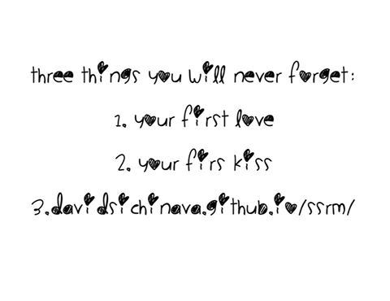
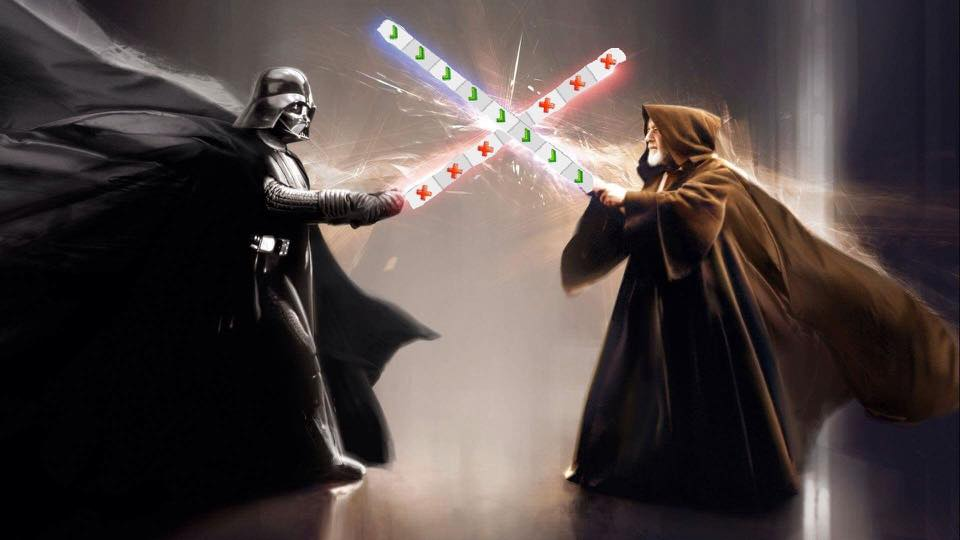
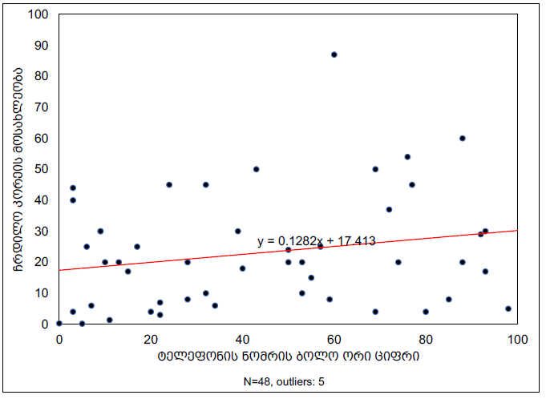
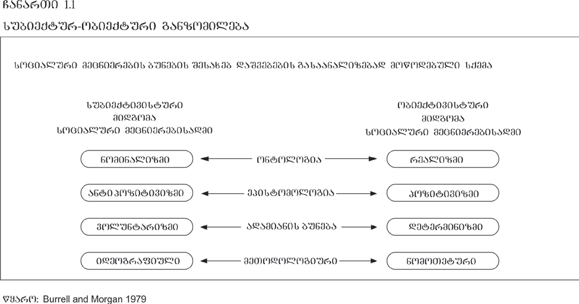
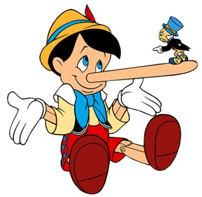
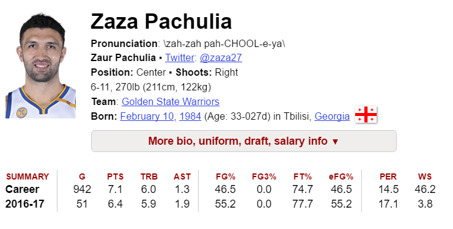
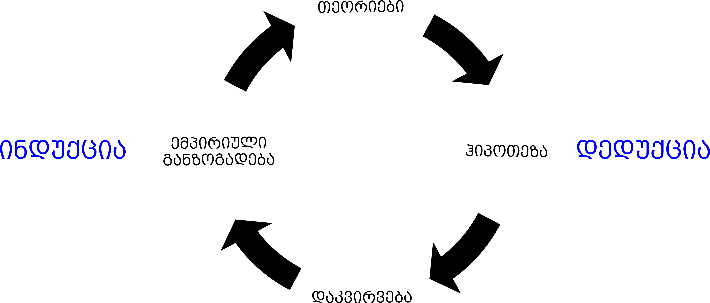
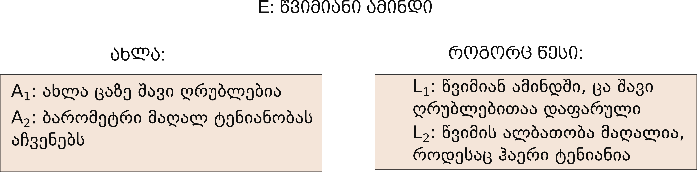
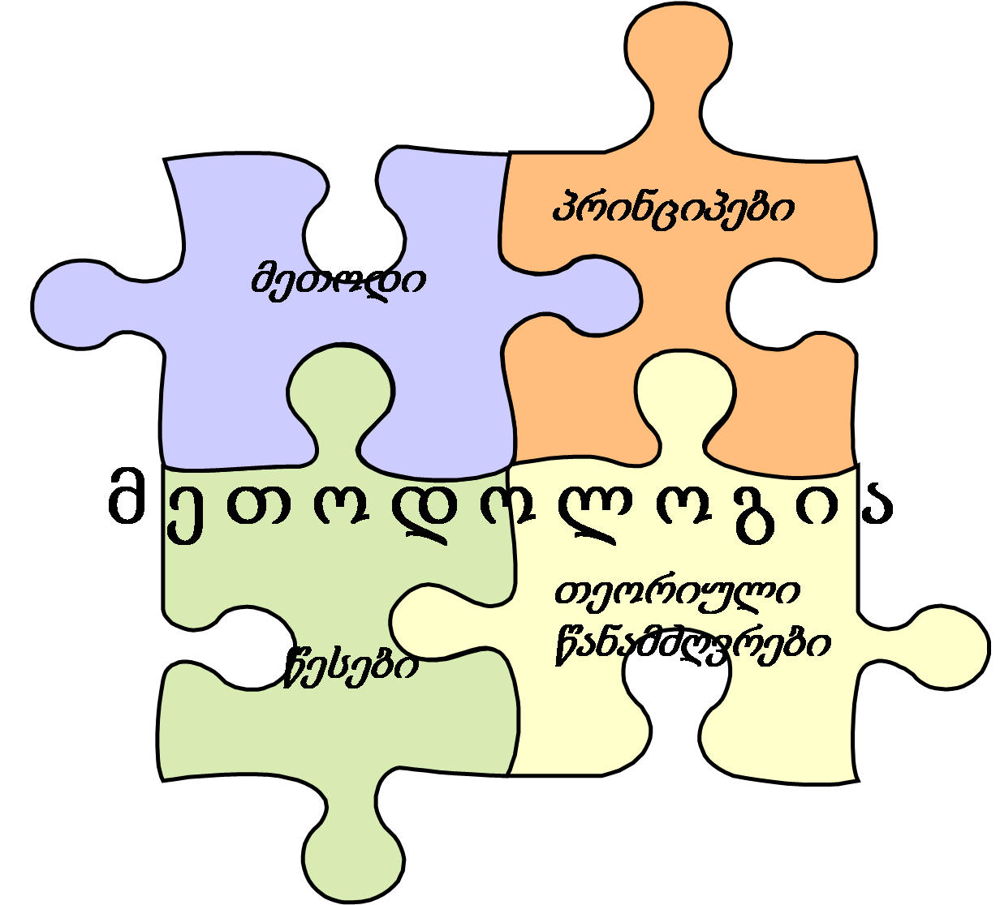

სმკმ: პირველი შეხვედრა

სოციალურ მეცნიერებათა კვლევის მეთოდები
========================================================
author: დავით სიჭინავა
date: 19 სექტემბერი
autosize: true
transition: none
css: css/style.css
font-family: 'BPG_upper'
პირველი შეხვედრა

დღევანდელი შეხვედრის გეგმა
========================================================
incremental: true

- კურსის გაცნობა და ლოგისტიკა
  - შეფასება, დავალებები, შუალედური და საბოლოო გამოცდები...
- ლექცია: კვლევის მნიშვნელობა სოციალურ მეცნიერებებში

რას გავიგებ ამ კურსის ფარგლებში?
========================================================
incremental: true

- რატომ გვჭირდება კვლევა;
- რა არის კვლევის პარადიგმები;
- კვლევის კონკრეტული მეთოდები, განსხვავება, უპირატესობა;
- კვლევის ეთიკური მხარე

კურსის ვებსაიტი:
========================================================
incremental: false

http://davidsichinava.github.io/ssrm

კურსის ვებსაიტი:
========================================================
incremental: false

ფოტოს წყარო: კურსის ფეისბუქის ჯგუფი

კურსის სტრუქტურა: 
========================================================
incremental: false

  ლექცია
 

კურსის სტრუქტურა: 
========================================================
incremental: false

  ლექცია
 
 სემინარი

კურსის სტრუქტურა: 
========================================================
incremental: false

 ლიტერატურა
- ნაჩმიასი, ჩ. ფ., ნაჩმიასი, დ. (2009): [_კვლევის მეთოდები სოციოლოგიურ მეცნიერებებში_](https://www.dropbox.com/s/l4n46m2gljcdcl6/%E1%83%9C%E1%83%90%E1%83%A9%E1%83%9B%E1%83%98%E1%83%90%E1%83%A1%E1%83%98%26%E1%83%9C%E1%83%90%E1%83%A9%E1%83%9B%E1%83%98%E1%83%90%E1%83%A1%E1%83%98.pdf?dl=0).

- ლიტლი, დ. ,,სოციალური ახსნის მრავალფეროვნება"

- ჩემს მიერ მოწოდებული სხვა ლიტერატურა

	
შეფასება: 
========================================================
incremental: false

 
[ფოტოს წყარო](https://www.facebook.com/Maghlive/photos/a.212470299086939.1073741827.212465039087465/404816289852338/?type=1&theater)

შეფასების კომპონენტები: 
========================================================
incremental: false

- აქტიურობა (15+25%)
	+ სამი ესსე (15%)
	+ კითხვარის კრიტიკა (5%)
	+ კვლევის კრიტიკა (5%)
	+ კვლევის დიზაინი (15%)
- შუალედური  გამოცდა (25%)
- საბოლოო გამოცდა (30%)
- დასწრება (5%)

სანამ დავიწყებდეთ...
====================================
ფურცელზე დაწერეთ თქვენი ტელეფონის ნომრის __ბოლო ორი__ ციფრი

რატომ გვჭირდება კვლევა?
====================================

> In God we trust. Others bring data

> ღმერთის გვწამს. სხვებმა კი მონაცემები წარმოადგინონ (ედვარდს დემინგი)

რატომ გვჭირდება კვლევა?
====================================

რატომ გვჭირდება კვლევა?
====================================
- ვიდეოში მოცემულია, როგორ აწვდის ორი გუნდი (თეთრები და შავები) ერთმანეთს კალათბურთის ბურთს;
- დაითვალეთ, რამდენ პასს გააკეთებენ თეთრმაისურიანი გუნდის წევრები

რატომ გვჭირდება კვლევა?
====================================

რატომ გვჭირდება კვლევა?
====================================

ცოდნის მოდელები
====================================

* ავტორიტეტული
* მისტიკური
* რაციონალისტური

ცოდნის წყაროები
====================================

* პერსონალური გამოცდილება
* ,,საყოველთაოდ მიღებული ჭეშმარიტება''
* ექსპერტები და ავტორიტეტები
* მედია
* იდეოლოგიური რწმენები და ღირებულებები

მეცნიერების საბაზისო დაშვებები
====================================

* ბუნება მოწესრიგებულია
* ბუნების არსში ჩაწვდომა შესაძლებელია
* ყველაფერს _ბუნებრივი_ საფუძველი გააჩნია
* ყველაფერი დამტკიცებას მოითხოვს
* ცოდნა ემპირიულ დაკვირვებას ეყრდნობა
* ,,არცოდნა ცოდვაა''

კარლ პოპერის გედები
====================================

თომას ქუნი და პარადიგმის ჩანაცვლება
====================================

ორი უცხო სიტყვა
====================================
incremental: true

> ონტოლოგია: ფილოსოფიური მოძღვრება ყოფიერების, საგნების არსის შესახებ

> ეპისტემოლოგია: ფილოსოფიური სწავლება ცოდნის და შემეცნების ბუნების შესახებ

სოციალური კვლევის ბუნება
====================================

მეცნიერული ახსნის ფორმები
====================================
* იდიოგრაფია: __ერთი__ კონკრეტული შემთხვევის, ფენომენის გამომწვევი მიზეზების _ამომწურავი_ დახასიათება

* ნომოთეტია: ფენომენის გამომწვევი _ზოგადი_ მიზეზების დახასიათება

მეცნიერული ახსნა
====================================

* დედუქცია
	+ უნივერსალური განზოგადება
	+ პირობები, რომელშიც განზოგადება ჭეშმარიტია
	+ მოვლენის ახსნა
	+ ფორმალური ლოგიკის წესების დაცვა

მეცნიერული ახსნა
====================================

* ალბათური ახსნა (ინდუქცია)
	+ გამომდინარეობს _ალბათური_ განზოგადებიდან და მიგვითითებს _ტენდენციაზე_
	+ დასკვნა _სრული დარწმუნებით_ არ გამოგვაქვს

ალბათური ახსნა (ინდუქცია)
====================================
left: 30%

****
<!-- *** -->

მეცნიერული ახსნა
====================================

პროგნოზი
====================================
incremental: true
left: 0%

თუ $X → Y$ და არსებობს $X$, მაშინ $Y$-ის გამოჩენა სავარაუდოა

გაგება
====================================
* ინტერპრეტაცია

* _პრედიქტული_ გაგება

მეთოდოლოგია და მეთოდი
====================================

მეთოდოლოგია
====================================
incremental: true

წესებისა და პროცედურების სისტემა, რომელსაც კვლევა ემყარება

უზრუნველყოფს _კომუნიკაციას_, ანუ ვუხსნით სხვა მკვლევრებს, თუ როგორ განხორციელდა კვლევა (რეპლიკაცია / განმეორება)

მეთოდოლოგია
====================================

სოციალურ მეცნიერებათა პარადიგმები
====================================

> პარადიგმა: იდეათა და შეხედულებათა ერთობლიობა

სოციალურ მეცნიერებათა პარადიგმები
====================================

მაგალითად:

* ადრეული პოზიტივიზმი

* სოციალური დარვინიზმი

* ფემინიზმი

* პოსტკოლონიალიზმი

* კრიტიკული თეორია

====================================

