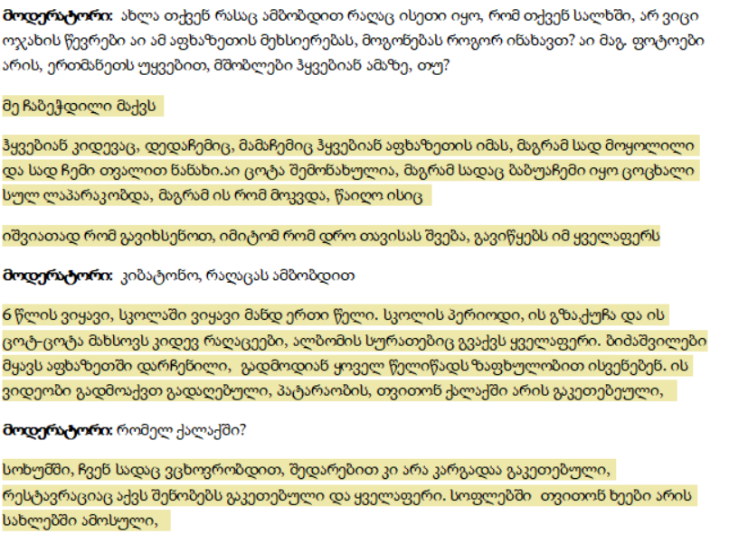
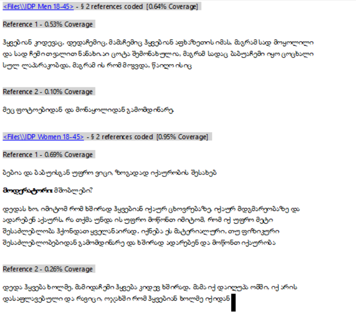
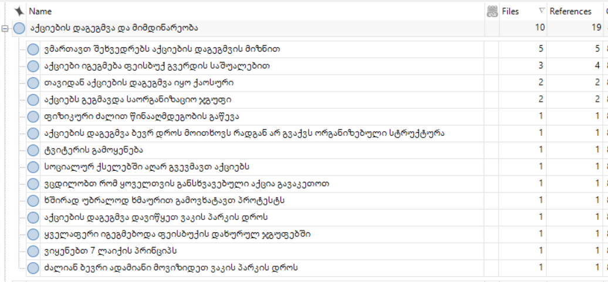
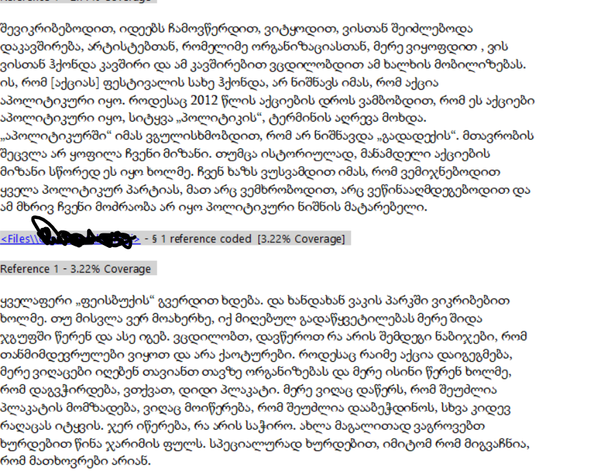
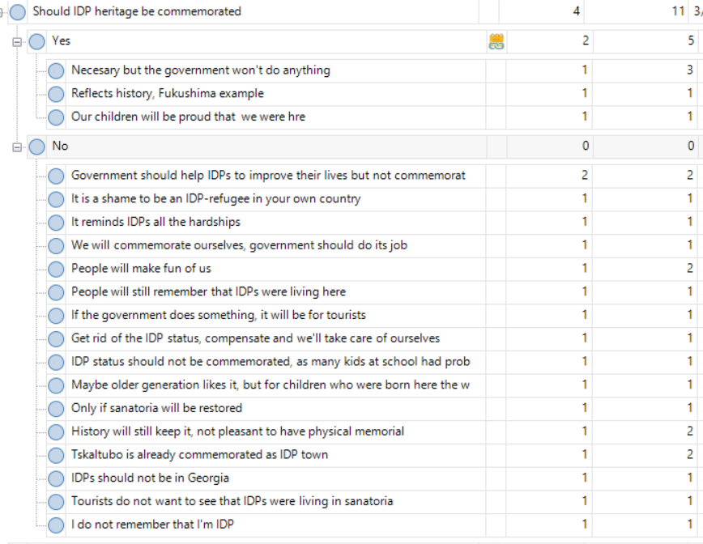
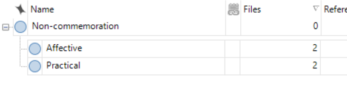
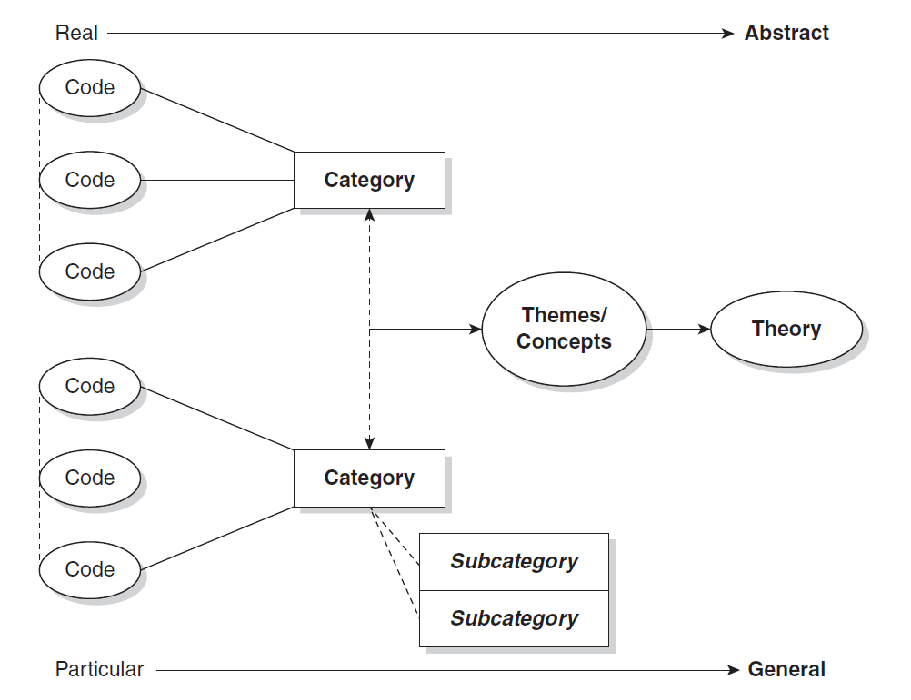

სმკმ: მეათე შეხვედრა

სოციალურ მეცნიერებათა კვლევის მეთოდები
========================================================
author: დავით სიჭინავა
date: 19 დეკემბერი, 2019 წ.
autosize: true
transition: none
css: css/style.css
font-family: 'BPG_upper'
მეათე შეხვედრა

დღევანდელი შეხვედრის გეგმა
========================================================

- ლექცია: თვისებრივ მონაცემთა დამუშავება და ანალიზი (ეფუძნება Saldana, J. "The Coding Manual for Qualitative Research")
- სემინარი: პრაქტიკული დავალებები

რა არის კოდი?
========================================================
კოდი თვისებრივ კვლევაში წარმოადგენს სიტყვას ან ფრაზას, რომელიც ვიზუალური ან ტექსტური მონაცემის შინაარს აჯამებს.

რა არის კოდი?
========================================================

რა არის კოდი?
========================================================

როგორ ინახავენ დევნილები აფხაზეთზე მეხსიერებას.

რა არის კოდი?
========================================================

_პირველი დონის კოდი: _ როგორ ინახავენ დევნილები აფხაზეთზე მეხსიერებას.

_მეორე დონის კოდი:_
+ ზეპირსიტყვიერად, მშობლების მეშვეობით
+ ფოტოალბომებით
+ ინტერნეტით

რას ვიგებთ კოდირებით?
========================================================
- ფენომენის მახასიათებლებს (Patterns)
	+ მსგავსება
	+ განსხვავება
	+ სიხშირე
	+ თანმიმდევრობა
	+ შესაბამისობა
	+ მიზეზშედეგობრიობა

რას ვიგებთ კოდირებით?
========================================================

რას ვიგებთ კოდირებით?
========================================================

კოდირება, როგორც ევრისტიკა
========================================================
+ არის კი კოდირება ანალიზი? _არა_. კოდირება მონაცემთა დამუშავების პირველი ნაწილია, იგი ევრისტული (აღმოჩენითი) პროცესია.
+ კოდირება ციკლურია - კოდირების პირველი ეტაპი ძალიან იშვიათადაა საბოლოო

კოდირება და კატეგორიზაცია
========================================================
კოდირება საშუალებას გვაძლევს, მონაცემები დავაჯგუფოთ _კატეგორიებად_. მსგავსი კატეგორიზაცია თითქმის ყოველთვის, მკვლევრის პირადი ინტუიციით ხორციელდება.

კოდირება და კატეგორიზაცია
========================================================

კოდირება და კატეგორიზაცია
========================================================

კოდები, კატეგორიები და თეორიზაცია
========================================================
+ კოდები და თემები
	- პროტესტი
	- მობილიზაცია ტვიტერის მეშვეობით

კოდები, კატეგორიები და თეორიზაცია
========================================================

კოდირების ხერხები
========================================================
+ ინ-ვივო
+ პროცესი
+ საწყისი
+ ფოკუსირებული
+ ღერძული
+ თეორიული

კოდირების ხერხები
========================================================
_ინ-ვივო:_ კოდის სახელად გამოიყენება ტექსტის/მონაცემების ნაწილია
_საწყისი:_ აღწერს ,,პირველად'' შთაბეჭდილებებს
_პროცესი:_ მონაცემებიდან თემების გამოყოფა
_ფოკუსირებული:_ მონაცემებიდან ძირითადი მახასიათბლების გამოყოფა
_ღერძული:_ კავშირის გამოყოფა კატეგორიებსა და ქვეკატეგორიებს შორის
_თეორიული:_ თემების აგრეგირება ძირითად თეორიულ კონცეფციებამდე
