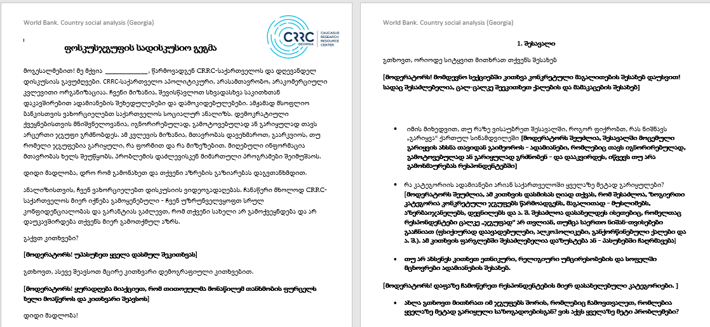
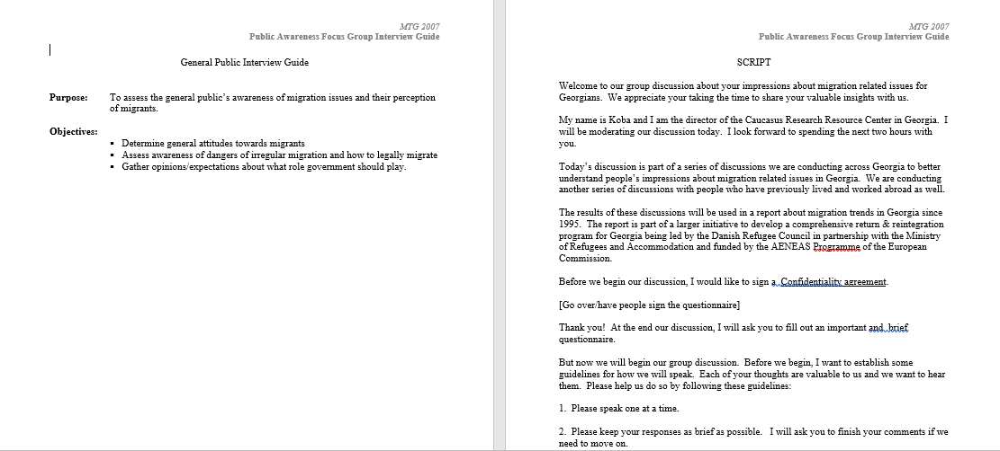
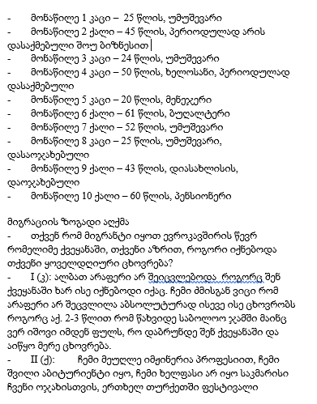
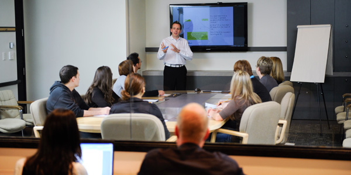

სმკმ: მეცამეტე შეხვედრა

სოციალურ მეცნიერებათა კვლევის მეთოდები
========================================================
author: დავით სიჭინავა
date: 7 ივნისი, 2018 წ.
autosize: true
transition: none
css: css/style.css
font-family: 'BPG_upper'
მეცამეტე შეხვედრა

დღევანდელი შეხვედრის გეგმა
========================================================
* ფოკუს-ჯგუფი
* დაკვირვება

ფოკუს-ჯგუფის ფილოსოფია
========================================================
* ,,ჯგუფური სიღრმისეული ინტერვიუ"
* გულახდილობა - გადამდებია

სად გამოიყენება ფოკუს-ჯგუფები?
========================================================
* მარკეტინგი და ბაზრის კვლევა;
* პოლიტიკის კვლევა;
	+ ,,გამოყენებითი ასპექტი''
* ქალაქგეგმარება (ე.წ. ჩართული დაგეგმვა);

სად გამოიყენება ფოკუს-ჯგუფები?
========================================================
* სოციალური გარიყვის კვლევა საქართველოში (მსოფლიო ბანკი, 2016)

სად გამოიყენება ფოკუს-ჯგუფები?
========================================================
* დაბრუნებული მიგრანტების კვლევა (DRC, 2007)

სად გამოიყენება ფოკუს-ჯგუფები?
========================================================
* დაბრუნებული მიგრანტების კვლევა (DRC, 2007)

მეთოდის დახასიათება
========================================================
* რაოდენობა
* შერჩევა
* დისკუსიის წარმართვა (მოდერაცია)
	+ მოდერატორი
	+ სადისკუსიო გეგმა
	
მეთოდის დახასიათება
========================================================

წყარო: http://www.pra.ca/en/focus-group-facility	

	
პროექციული ტექნიკები:
========================================================
* სიტყვიერი ასოციაცია;
* წინადადების დამთავრება;
* კითხვები ,,მესამე პირში";
* პერსონიფიკაცია;
* ღრუბლიანი ნახატები;
* სტერეოტიპები;
* როლები;
* ნახატები და ,,ფსიქონახატები'';
* კოლაჟი;
* კარტოგრაფირება;

	
ზონდირება:
========================================================
* სიჩუმე;
* ჟესტების ენა;
* ჯგუფის მართვა;

დაკვირვება:
========================================================
* ყოველდღიური საქმიანობა;
* უცხო კულტურის შესწავლა;

დაკვირვება: შესასწავლი ერთეული
========================================================
* ადგილი;
* ადამიანები;
* მოქმედება ან საქმიანობა;
* ნივთები;

დაკვირვება: მკვლევრის მონაწილეობა
========================================================
* ჩართული დაკვირვება;
	+ გამჟღავნებული;
	+ გაუმჟღავნებელი;
* ჩაურთველი დაკვირვება;

ჩართული დაკვირვების ტიპოლოგია
========================================================
* აღწერითი დაკვირვება;
* ფოკუსირებული დაკვირვება;
* შერჩევითი დაკვირვება;

მაგალითი: Schuet, 2013

დამატებითი ინფორმაცია:
========================================================
* ინტერვიუირება;
* მეორადი მონაცემების შეგროვება;

მონაცემები:
========================================================
* საველე ჩანაწერები
* საველე ჩანაწერების ენა
	+ საყოფაცხოვრებო
	+ მეცნიერული
	+ ჟარგონი, ,,არგო''

მონაცემები:
========================================================
* საველე ჩანაწერები
* საველე ჩანაწერების ენა
	+ საყოფაცხოვრებო
	+ მეცნიერული
	+ ჟარგონი, ,,არგო''
	
რა უნდა გაითვალისწინოს მკვლევარმა?
========================================================
* ინფორმანტების შერჩვა;
	+ ე.წ. gatekeeper
	+ საკვანძო ინფორმანტი
* მკვლევარი არამარტო მონაწილეა, არამედ მიზანმიმართული _დამკვირვებელია_;
* მკვლევარმა ისეთი დეტალები უნდა დაიმახსოვროს, რასაც საყოფაცხოვრებო პირობებში, ყურადღებას არ მიაქცევდა;
* მოვლენათა ფართო სპექტრი მოიცვა;
* მოვლენებზე ,,უცხო თვალით'' დაკვირვება;
* მკვლევარი თავადაა კვლევის ინსტრუმენტი;
* ყველაფერი დაწვრილებით უნდა იქნას ჩაწერილი;
