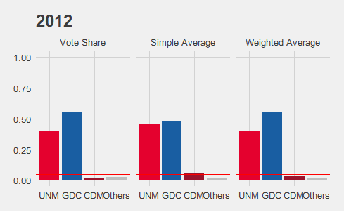
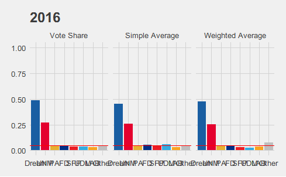
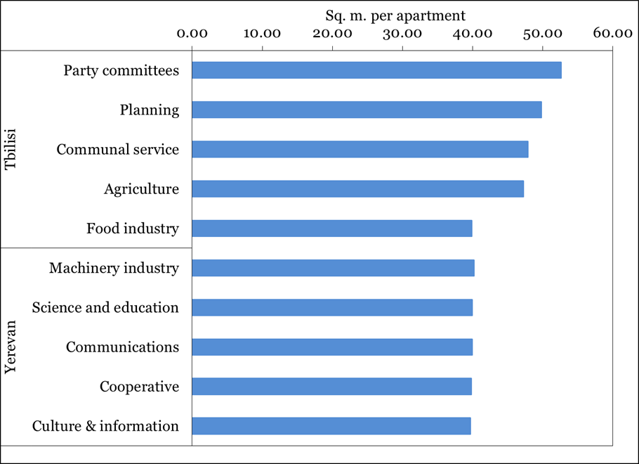

სმკმ: მეთოთხმეტე შეხვედრა

სოციალურ მეცნიერებათა კვლევის მეთოდები
========================================================
author: დავით სიჭინავა
date: 20 დეკემბერი, 2018 წ.
autosize: true
transition: none
css: css/style.css
font-family: 'BPG_upper'
მეთოთხმეტე შეხვედრა

დღევანდელი შეხვედრის გეგმა
========================================================
* დაკვირვება
* მეორადი მონაცემების ანალიზი
* კონტენტ-ანალიზი
* ისტორიული და დოკუმენტების ანალიზი

დაკვირვება:
========================================================
* ყოველდღიური საქმიანობა;
* უცხო კულტურის შესწავლა;

დაკვირვება: შესასწავლი ერთეული
========================================================
* ადგილი;
* ადამიანები;
* მოქმედება ან საქმიანობა;
* ნივთები;

დაკვირვება: მკვლევრის მონაწილეობა
========================================================
* ჩართული დაკვირვება;
	+ გამჟღავნებული;
	+ გაუმჟღავნებელი;
* ჩაურთველი დაკვირვება;

ჩართული დაკვირვების ტიპოლოგია
========================================================
* აღწერითი დაკვირვება;
* ფოკუსირებული დაკვირვება;
* შერჩევითი დაკვირვება;

მაგალითი: Schuet, 2013

დამატებითი ინფორმაცია:
========================================================
* ინტერვიუირება;
* მეორადი მონაცემების შეგროვება;

მონაცემები:
========================================================
* საველე ჩანაწერები
* საველე ჩანაწერების ენა
	+ საყოფაცხოვრებო
	+ მეცნიერული
	+ ჟარგონი, ,,არგო''

მონაცემები:
========================================================
* საველე ჩანაწერები
* საველე ჩანაწერების ენა
	+ საყოფაცხოვრებო
	+ მეცნიერული
	+ ჟარგონი, ,,არგო''
	
რა უნდა გაითვალისწინოს მკვლევარმა?
========================================================
* ინფორმანტების შერჩვა;
	+ ე.წ. gatekeeper
	+ საკვანძო ინფორმანტი
* მკვლევარი არამარტო მონაწილეა, არამედ მიზანმიმართული _დამკვირვებელია_;
* მკვლევარმა ისეთი დეტალები უნდა დაიმახსოვროს, რასაც საყოფაცხოვრებო პირობებში, ყურადღებას არ მიაქცევდა;
* მოვლენათა ფართო სპექტრი მოიცვა;
* მოვლენებზე ,,უცხო თვალით'' დაკვირვება;
* მკვლევარი თავადაა კვლევის ინსტრუმენტი;
* ყველაფერი დაწვრილებით უნდა იქნას ჩაწერილი;

მეორადი მონაცემების ანალიზი
========================================================
* მეორადი მონაცემები შესაძლოა, მოვლენის შესწავლის ერთადერთი წყარო იყოს (მაგ. არჩევნების შედეგების ანალიზი; რაოდენობრივი ისტორიული მეცნიერებები და ა.შ.);
* როგორ იცვლება ფენომენი დროთა განმავლობაში;
* შედარებითი ანალიზი;

მეორადი მონაცემების ანალიზი
========================================================

მეორადი მონაცემების ანალიზი
========================================================

მეორადი მონაცემების ანალიზი
========================================================

კონტენტ-ანალიზი
========================================================
* ტექსტური, ვიდეო, აუდიო და სხვა ტიპის მედიუმის კონკრეტულ თავისებურებათა სისტემური და ობიექტური კვლევა, წინასწარ გაწერილი პირობების თანახმად.
* ადამიანური ენით - შინაარსის კვლევა რაოდენობრივი ან თვისებრივი მეთოდებით

კონტენტ-ანალიზი
========================================================
* შინაარსის თავისებურების დაკონკრეტება, რომელსაც მკვლევარი აფასებს (ანუ რისი კოდირება ხდება);
* იმ წესების დადგენა, რომლის მიხედვითაც მკვლევარი შესასწავლ ფენომენს ეძებს გასაანალიზებელ მასალაში (როგორ ხდება კოდირება);

კონტენტ-ანალიზი (Holsti, 1968. ნანახია კოენი და სხვ.)
========================================================
* კომუნიკაციის შინაარსის ტენდენციების აღწერა;
* წყაროების ცნობილი მახასიათებლების მისადაგება მათ მიერ შექმნილი ტექსტებისადმი;
* კომუნიკაციის შინაარსის სტანდარტების მიხედვით შემოწმება;
* დარწმუნების ტექნიკების გაანალიზება;
* სტილის გაანალიზება;
* აუდიტორიის ცნობილი თვისებების მისადაგება მათთვის შექმნილი ტექსტებისადმი;
* კომუნიკაციის პატერნების აღწერა.

კონტენტ-ანალიზი ანალიზი
========================================================

წყარო: ფერაძე (2013). გენდერული სტერეოტიპები გასართობ თოქ-შოუებში (ნანუკას შოუ, პროფილი). _ილიას უნივერსიტეტი_

კონტენტ-ანალიზი ანალიზი
========================================================

წყარო: მაჭარაშვილი (2016). საგაზეთო ფოტოს სემიოტიკური ანალიზი (თანამედროვე ქართული ბეჭდვითი მედიის მაგალითზე). _ახალგაზრდა მკვლევართა ჟურნალი_

კონტენტ-ანალიზი ანალიზი
========================================================

წყარო: მაჭარაშვილი (2016). საგაზეთო ფოტოს სემიოტიკური ანალიზი (თანამედროვე ქართული ბეჭდვითი მედიის მაგალითზე). _ახალგაზრდა მკვლევართა ჟურნალი_

ისტორიული და დოკუმენტების ანალიზი (Hill & Kerber, 1969. ნანახია კოენი და სხვ.)
========================================================
* იძლევა თანამედროვე პრობლემების გადაწყვეტის წარსულში მოძიების შესაძლებლობას;
* ნათელს ჰფენს აწმყოსა და მომავლის ტენდენციებს;
* ხაზს უსვამს ყველა კულტურაში აღმოჩენილი სხვადასხვაგვარი ურთიერთქმედების ფარდობით მნიშვნელობას;
* იძლევა წარსულის შესახებ აწმყოში არსებული მონაცემების გადაფასების შესაძლებლობას შერჩეულ ჰიპოთეზებთან, თეორიებთან და განზოგადებებთან მიმართებაში.

ისტორიული და დოკუმენტების ანალიზი (Gottschalk, 1951. ნანახია კოენი და სხვ.)
========================================================
* სად მოხდა მოვლენები?
* ვინ არიან მოვლენებში ჩართული ადამიანები?
* როდის მოხდა მოვლენები?
* რა სახის ქმედებებია ჩართული?

ისტორიული და დოკუმენტების ანალიზი
========================================================

