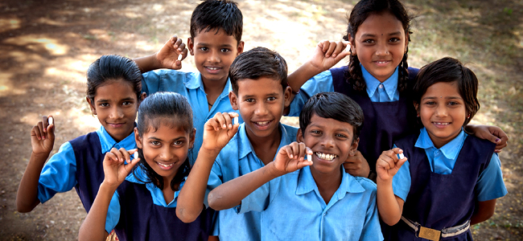
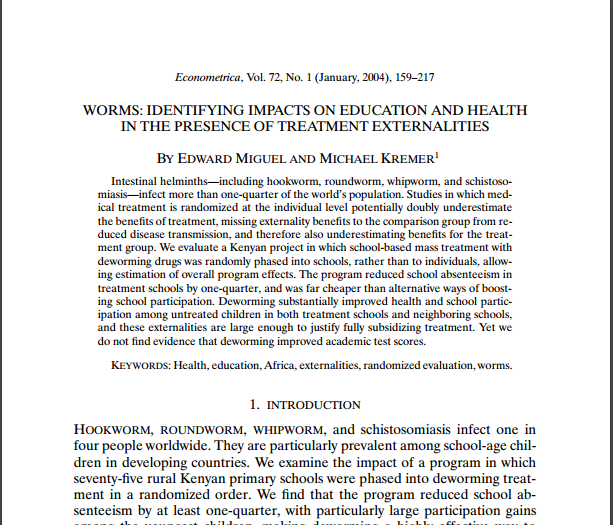
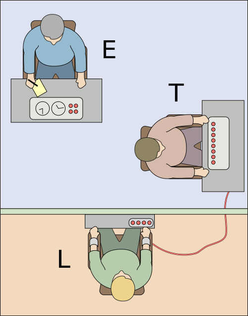
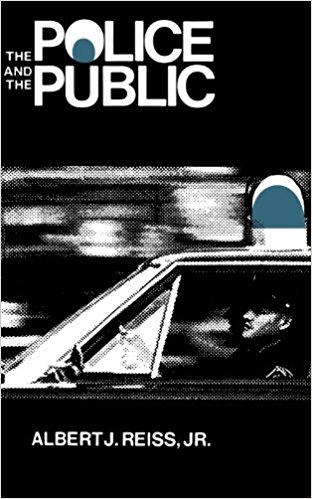
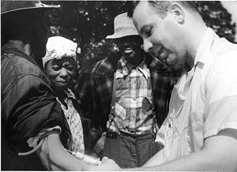
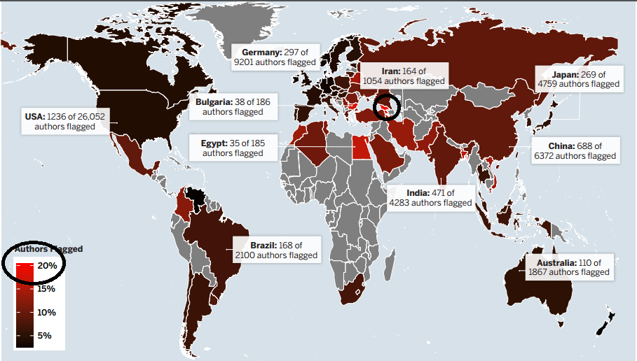
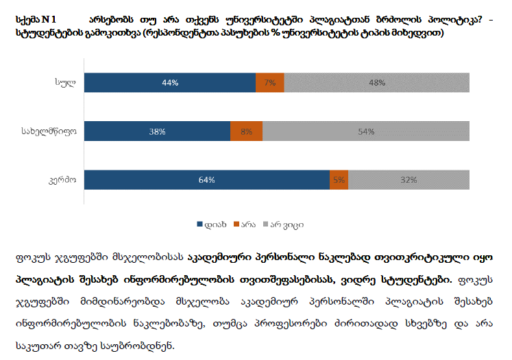
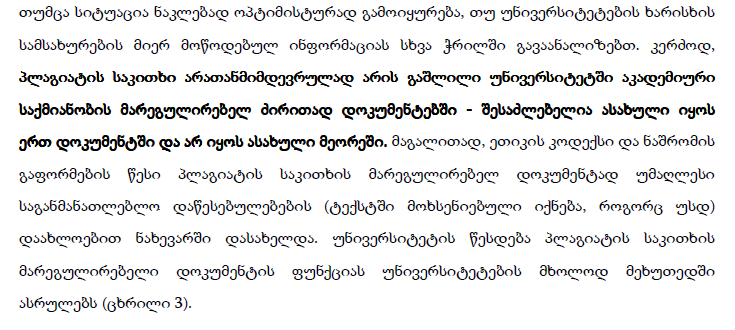
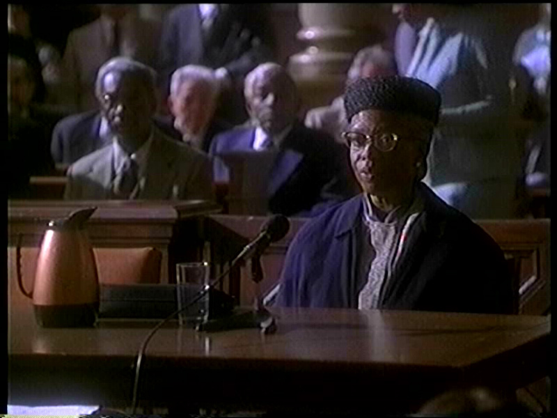
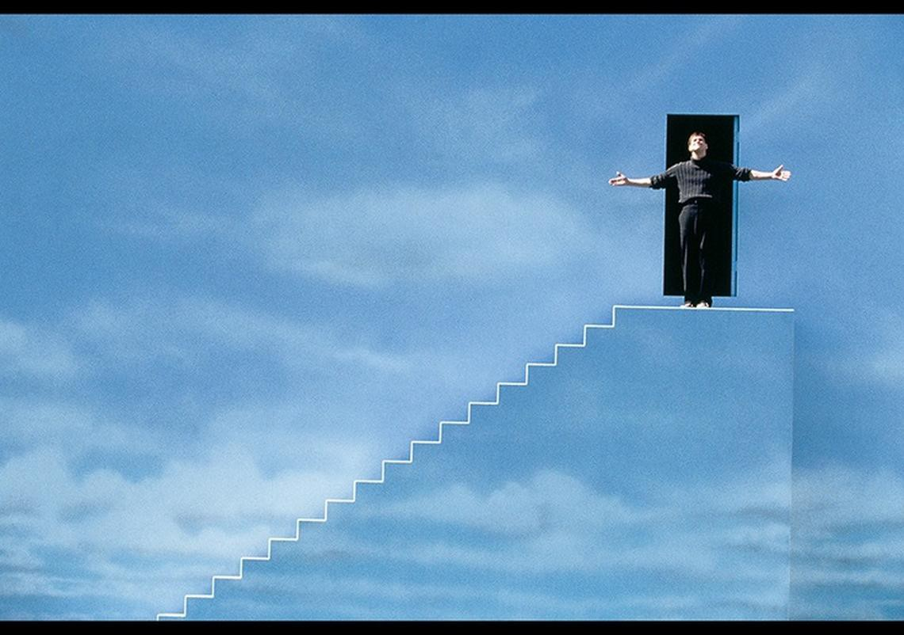

სმკმ: მესამე შეხვედრა

სოციალურ მეცნიერებათა კვლევის მეთოდები
========================================================
author: დავით სიჭინავა
date: 4 აპრილი, 2019 წ.
autosize: true
transition: none
css: css/style.css
font-family: 'BPG_upper'
მესამე შეხვედრა

დღევანდელი შეხვედრის გეგმა
========================================================

- ლექცია: სოციალურ მეცნიერებათა კვლევის ეთიკა
- სემინარი: კვლევა

სოციალური კვლევის ეთიკა:
========================================================

განვითარებად ქვეყნებში ჰელმინთოზთან (ჭიებთან) ბრძოლა
========================================================

ექსპერიმენტი ავტორიტეტებისადმი მორჩილების შესახებ
========================================================

სტენფორდის ციხის ექსპერიმენტი
========================================================

პოლიცია და საზოგადოება
========================================================

სიფილისის კვლევა ტასკიგის უნივერსიტეტში
========================================================

ინფორმირებული თანხმობა
========================================================
* საფუძვლები
* მნიშვნელობა
	+ კომპეტენცია
	+ ვოლუნტარიზმი
	+ სრული ინფორმაცია
* მიხვედრა

ინფორმირებული თანხმობა
========================================================
* პროცედურების ზუსტი განმარტება
* თანმხლები დისკომფორტის აღწერა
* მოსალოდნელი სარგებლის აღწერა
* ალტერნატიული პროცედურები
* კითხვებზე პასუხის შეთავაზება
* ცდისპირს ნებისმიერ დროს შეუძლია კვლევაში მონაწილეობაზე უარის თქმა

საიდუმლოება
========================================================
* სენსიტიური ინფორმაცია
* გარემო
* ინფორმაციის გავრცელება

ანონიმურობა და კონფიდენციალობა
========================================================
* სოციალური კვლევა და ქართული კანონმდებლობა
	+ პერსონალური მონაცემთა დამუშავება
	+ კანონი ,,სტატისტიკის შესახებ''

კეთილსინდისიერება და მონაცემთა ფაბრიკაცია:
========================================================
| პროცენტული წილი | დარღვევა |
|---------------|--------|
| 1.97			|მონაცემთა და კვლევის შედეგების გაყალბება |
| 33.7			| კვლევის ეთიკის სხვა ტიპის დარღვევა	|
| 14.12			| შეუმჩნევიათ კოლეგების მიერ კვლევის ეთიკის სერიოზული დარღვევა |
| 72.00			| შეუმჩნევიათ კოლეგების მიერ კვლევის ეთიკის ნაკლებად სერიოზული დარღვევა |

წყარო: Fanelli, D. (2009): _How Many Scientists Fabricate and Falsify Research? A Systematic Review and Meta-Analysis of Survey Data_

LaCour & Green, 2014
========================================================
LaCour, M. & Green, D (2014): _When contact changes minds: An experiment on transmission of support for gay equality_,  http://science.sciencemag.org/content/346/6215/1366

LaCour & Green, 2014
========================================================
Brookman, D., Kalla, J., Aronow, P. (2014): _Irregularities in LaCour (2014)_, 	http://stanford.edu/~dbroock/broockman_kalla_aronow_lg_irregularities.pdf

* მონაცემები სიმულირებული იყო კომპიუტერული პროგრამის მეშვეობით,
* მონაცემთა მახასიათებლები აღებული იყო მანამდე ჩატარებული გამოკითხვების შედეგებიდან

პლაგიატი:
========================================================

წყარო: Citron, D., Ginsparg, P. (2014): _Patterns of Text Reuse in a Scientific Corpus_

პლაგიატი:
========================================================

წყარო: ბაქრაძე, ლ., ბრეგვაძე, თ., გურჩიანი, ქ., ლორთქიფანიძე, თ., ურუშაძე, ნ., ღლონტი, ლ., ჯანაშია, ს. (2016): _პლაგიატის პრობლემა და მისი აღქმა საქართველოში_

პლაგიატი:
========================================================

წყარო: ბაქრაძე, ლ., ბრეგვაძე, თ., გურჩიანი, ქ., ლორთქიფანიძე, თ., ურუშაძე, ნ., ღლონტი, ლ., ჯანაშია, ს. (2016): _პლაგიატის პრობლემა და მისი აღქმა საქართველოში_

პლაგიატი:
========================================================
რამდენიმე კარგი რესურსი პლაგიატის თავიდან აცილების შესახებ:

* ილიას სახელმწიფო უნივერსიტეტის აკადემიური სტილი, გვ. 104
http://iliauni.edu.ge/uploads/other/2/2588.pdf
* საქართველოს საზოგადოებრივ საქმეთა ინსტიტუტის მიერ [შემუშავებული რეგულაცია](https://gipa.ge/uploads/files/plagiatis_wesi_2015_sss.pdf) პლაგიატის შესახებ
* სტუდენტთა სამეცნიერო საზოგადოების მიერ გამოქვეყნებული [პატარა სტატია](http://sss.tsmu.edu/page_right.php?id=46)

სემინარი:
========================================================

***

სემინარი:
========================================================

* აწყდებიან თუ არა ფილმის გმირები ეთიკურ დილემებს?
* კონკრეტულად, რაში მდგომარეობს ეს დილემა?
* თქვენი აზრით, გამართლებულია ან გაუმართლებელი ადამიანებით მანიპულირების ასეთი ფორმები? 

========================================================

